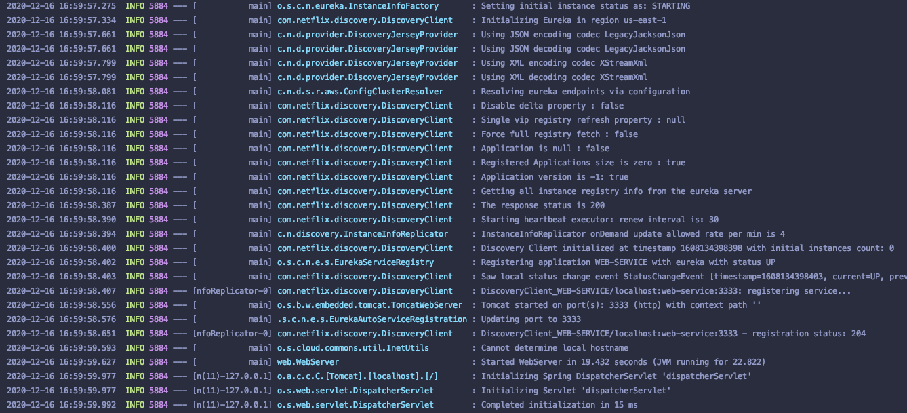
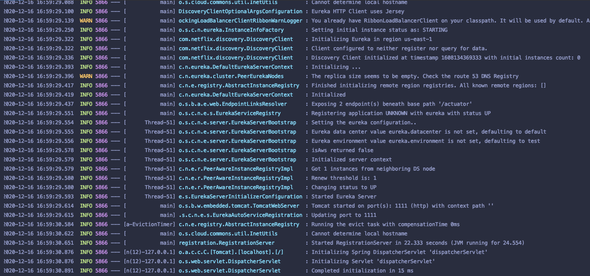
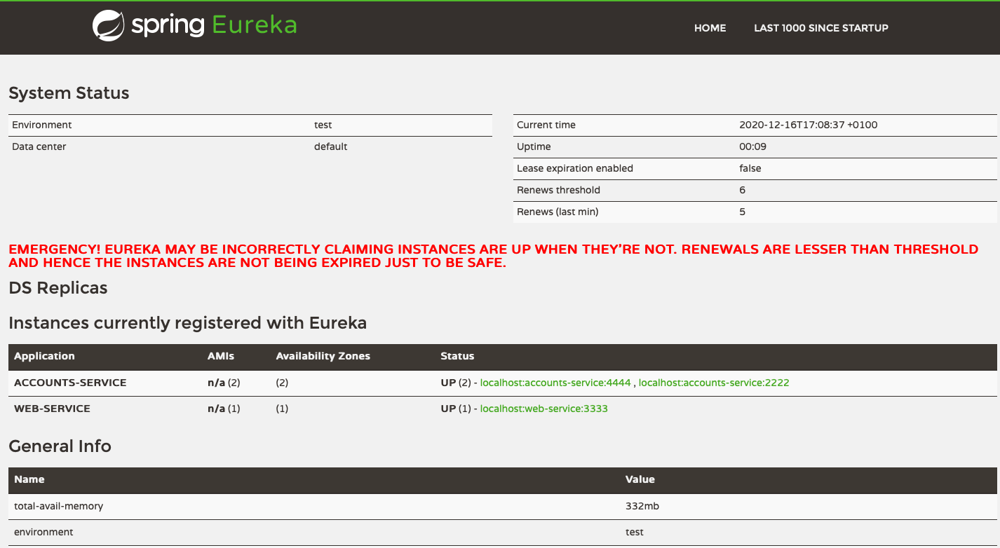

## Activities:

* **The two microservices accounts (2222) and web are running and registered (two terminals, logs screenshots):**

Accounts service running on port 2222:

      
Web service running on port 3333:

* **The service registration service has the two microservices registered (a third terminal, dashboard screenshots):**

Registration server running on port 1111:

Registration dashboard:

* **A second account microservice is running in the port 4444 and it is registered 
(a fourth terminal, log screenshots).**

Second account service running on port 4444:

Dashboard showing the second account service is running and registered:

* **What happens when the microservice running on port 2222 is killed? Can the web service provide information
about the accounts and why?**

Dashboard after service is killed:

After killing the microservice, it is removed from the registered applications list of the dashboard, nevertheless,
since there is another instance of the accounts service running (the one on port 4444) the web service can still 
provide information about the accounts using that second microservice instance. 
